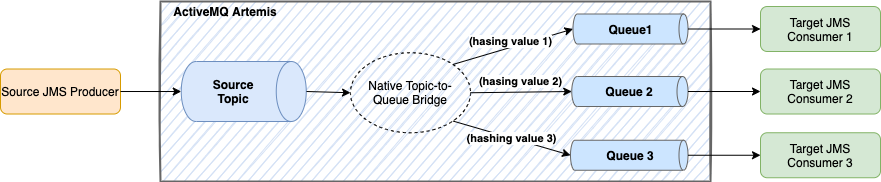
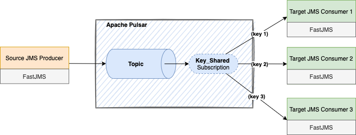

- [1. JMS Pattern Overview](#1-jms-pattern-overview)
  - [1.1. Apache Pulsar Key_Shared Subscription](#11-apache-pulsar-key_shared-subscription)
- [2. Use DataStax FastJMS for Pulsar API  to Achieve the Same JMS Pattern Semantics](#2-use-datastax-fastjms-for-pulsar-api--to-achieve-the-same-jms-pattern-semantics)
  - [2.1. DS FastJMS API Configuration](#21-ds-fastjms-api-configuration)

# 1. JMS Pattern Overview 

The following diagram shows one JMS application pattern where a JMS message producer publish messages to a topic from which the messages are routed to a few downstream queues based on the hashing value of a certain message property. Each JMS queue has a corresponding consumer to read messages from the queue.



The "Topic-to-Queue" with filtering/routing capability can be achieved using a JMS provider's own feature. For example, ActiveMQ [Virtual Destination](http://activemq.apache.org/virtual-destinations) is exactly such a feature.

## 1.1. Apache Pulsar Key_Shared Subscription 

The message processing semantics as expressed in the previous JMS pattern is exactly the same as Apache Pulsar's [**Key_Shared**](https://pulsar.apache.org/docs/en/concepts-messaging/#key_shared) subscription type.

# 2. Use DataStax FastJMS for Pulsar API  to Achieve the Same JMS Pattern Semantics

Using [DataStax FastJMS for Pulsar API (DS FastJMS API)](https://github.com/datastax/pulsar-jms), we can achieve exactly the same message processing semantics using existing JMS applications against a Apache Pulsar server (instead of a native JMS provider server like ActiveMQ) with a minimum amount of code change. The adjusted pattern diagram looks like below:



## 2.1. DS FastJMS API Configuration

In order for the DS FastJMS API to utilize Pulsar's Key_Shared subscription feature, the following configuration is needed in order to establish the connection.

```
    Map<String, Object> clientConfMap = new HashMap<>();

    Map<String, Object> producerConfig = new HashMap<>();
    // batch is enabled by default in Pulsar
    producerConfig.put("batcherBuilder", "KEY_BASED");

    clientConfMap.put("producerConfig", producerConfig);
    clientConfMap.put("jms.topicSharedSubscriptionType", "Key_Shared");

    PulsarConnectionFactory factory = new PulsarConnectionFactory(jmsConfMap);
    ... ... 
```